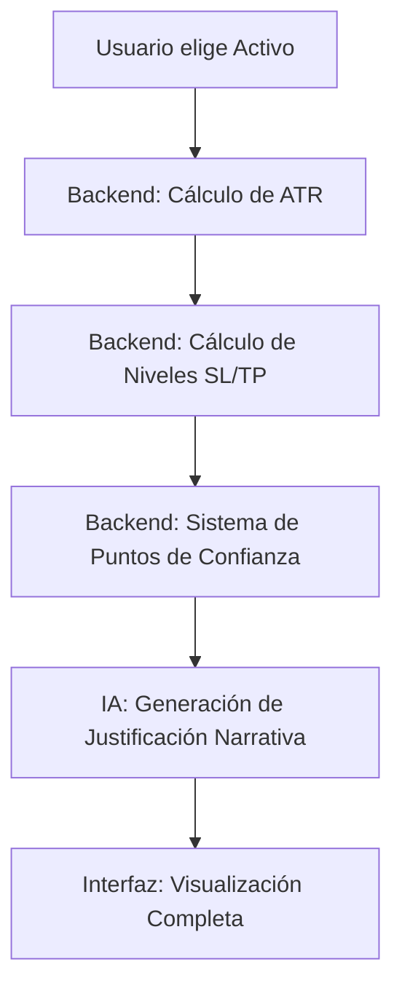

# Integración: IA + ATR + Confianza

Este documento explica cómo colaboran el motor matemático y la Inteligencia Artificial para generar una recomendación coherente.

## 1. El Flujo de Datos
El sistema opera en tres capas secuenciales para asegurar que la recomendación sea precisa pero también fácil de entender.

## 2. ¿Qué hace cada parte?

### Los Cálculos (El "Cuerpo")
El código en el servidor se encarga de la **física** de la operación:
- **ATR Dinámico:** Usa la volatilidad histórica de las últimas 14 velas para decidir que el Stop Loss debe estar a $150.40, por ejemplo.
- **Nota de Confianza:** Si el RSI está en sobreventa y tú quieres Comprar, el código asigna automáticamente un valor de confianza alto (ej. 80%).

### La IA (El "Cerebro")
La IA no calcula los números, sino que los **interpreta**. Recibe un paquete de datos como este:
> *"Activo: AAPL | Dirección: LONG | SL: 140.5 (ATR 1.5x) | Confianza: 80% | RSI: 35 | MACD: Alcista"*

Con esto, la IA redacta el texto: 
> *"La operación presenta una alta confianza (80%) debido a que el precio se encuentra en zona de sobreventa (RSI 35) coincidiendo con un cruce alcista en el MACD. El Stop Loss dinámico protege la posición ante la volatilidad actual detectada por el ATR..."*

## 3. Beneficios de esta Integración

1. **Sin Alucinaciones:** La IA no puede "inventarse" que el Stop Loss debe estar en un sitio erróneo, porque el nivel de precio ya viene fijado por el cálculo del ATR previo.
2. **Contexto Profesional:** Aunque el número de confianza sea un 60% (neutral), la IA te explicará **por qué** es neutral (ej. *"Señal mixta entre indicadores"*), algo que un simple número no podría hacer.
3. **Seguridad en el TFG:** Tu proyecto demuestra el uso de **Inteligencia Artificial Aplicada**, donde la IA no solo "habla", sino que razona sobre datos técnicos reales y verificables calculados por tu propio motor de trading.

---
> [!NOTE]
> Esta arquitectura asegura que tu sistema de trading sea robusto matemáticamente y profesional en su comunicación con el usuario final.
